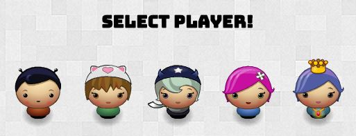
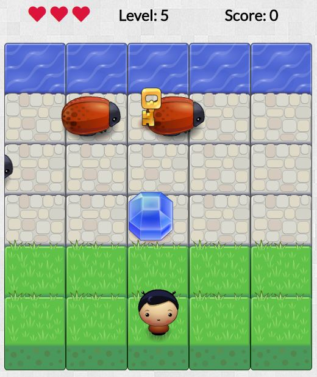

# Frogger Arcade Game

## About the game
Project created during the Udacity/Google Front-End Web Developer Nanodegree Program.

## How to load the game
Download or clone this project and open the index.html file in your browser.
Alternatively, you can play the game online at: https://ioanazorila.github.io/frontend-nanodegree-arcade-game/index.html

## How to play the game
The objective of the game is to guide the character across the screen in order to reach the water, and to earn as many points as possible.

To start the game, click on one of the 5 characters to select it.

Using the arrow keys, guide the character across the screen in order to reach the water.

Avoid the bugs. When colliding with a bug, the character will lose a life and several points, and it will be reset to his initial position.
The speed of the bugs increases as the character levels up.

To increase your score, make sure to collect some gems on your way to the water.

The character gains or loses points as explained below:

|       Action        |          Score           |
|---------------------|--------------------------|
| Collide with bug    | -5                       |
| Reach water         | +(5 + character's level) |
| Collect blue gem    | +1                       |
| Collect green gem   | +2                       |
| Collect key         | +5                       |

When the character "dies" (loses his 3 lives), an end of game message will be displayed:
- character wins the game if his score is positive
- character loses the game if his score is negative

Click on the **⭮** button to select a new character and start a new game.

Enjoy the game! 🙂

## Sources
- The project is based on a game engine provided by Udacity
- Webpage background pattern from Subtle Patterns
